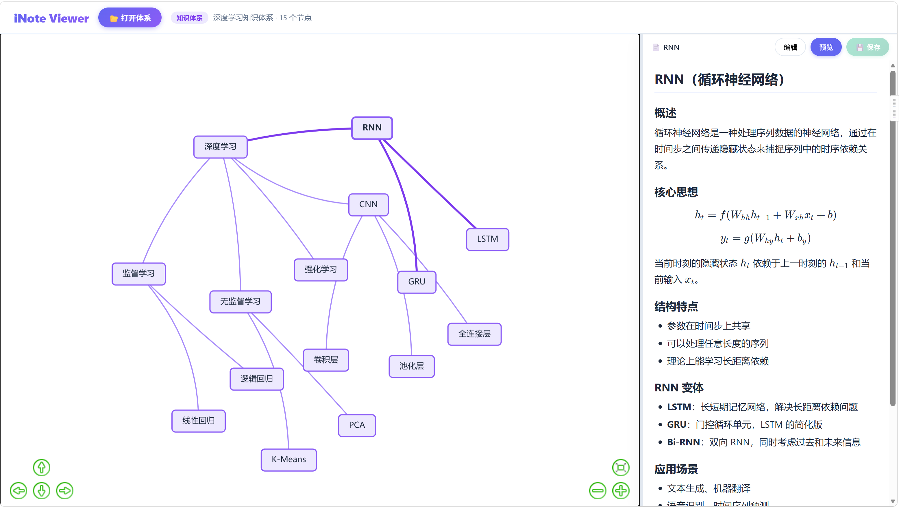
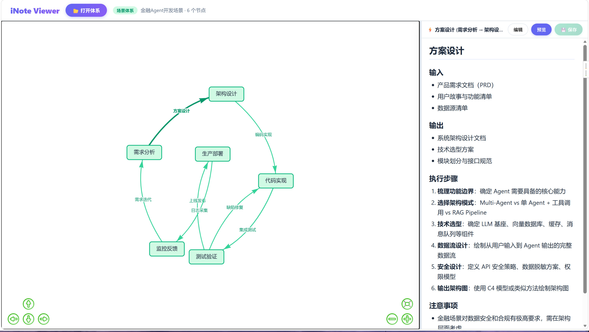

# iNote

基于本地文件的笔记体系规范 + 可视化浏览器。用 Markdown 写笔记，用 JSON 定义关系，用浏览器看图。

## 为什么选择 iNote？

- **本地优先** — 所有文件都在你自己的文件夹里，不依赖任何云服务或数据库
- **即开即用** — 一个 HTML 文件就是完整应用，双击打开，无需安装
- **Markdown + 数学** — 标准 Markdown 写作，KaTeX 渲染数学公式
- **图景可视化** — 自动将节点和关系渲染为交互式网络图
- **双模式编辑** — 图形中点击节点即可预览/编辑，Ctrl+S 保存

## 两种体系类型

| | Knowledge（知识体系） | Scenario（场景体系） |
|---|---|---|
| 用途 | 整理概念层级关系 | 描述流程和动作 |
| 关系 | 父子「包含」 | 有向「动作」 |
| 连线 | 无箭头连线 | 有向箭头 |

### Knowledge 示例

```
深度学习
├── 监督学习
│   ├── 线性回归
│   └── 逻辑回归
├── 无监督学习
│   ├── K-Means
│   └── PCA
├── CNN
│   ├── 卷积层
│   ├── 池化层
│   └── 全连接层
└── RNN
    ├── LSTM
    └── GRU
```



### Scenario 示例

```
需求分析 → 架构设计 → 代码实现 → 测试验证 → 生产部署 → 监控反馈
    ↑                        ↓           ↑              │
    └────────────────────────┘           └── 缺陷修复 ──┘        └── 需求迭代 ──┘
```



## 快速开始

1. 克隆或下载本项目

   ```bash
   git clone https://github.com/oxolong/inote.git
   ```

2. 用浏览器打开 `inote-viewer.html`（Chrome / Edge 86+）

3. 点击 **📂 打开体系**，选择 `示例-深度学习知识体系/` 或 `示例-金融Agent开发场景/` 文件夹

4. 在左侧图中点击**节点**查看笔记，点击**连线**查看关系

5. 点击**编辑**按钮可修改笔记，`Ctrl+S` 保存

> **浏览器要求**：Chrome 86+ 或 Edge 86+（需要 File System Access API）

## 文件结构

一个 iNote 体系就是一个文件夹：

### Knowledge 体系

```
体系名/
├── _inote.json          # 元数据（必须）
├── 概念A.md
├── 概念B.md
└── 概念C.md
```

### Scenario 体系

```
体系名/
├── _inote.json          # 元数据（必须）
├── 起点节点.md
├── 中间节点.md
└── actions/             # 动作目录（必须）
    ├── from(A)to(B)act(X).md
    └── from(B)to(C)act(Y).md
```

## `_inote.json` 格式速览

### Knowledge

```json
{
  "version": "1.0",
  "type": "knowledge",
  "name": "体系名称",
  "nodes": [
    { "id": "n1", "name": "概念名称", "file": "概念名称.md" }
  ],
  "contains": [
    { "parent": "n1", "child": "n2" }
  ]
}
```

### Scenario

```json
{
  "version": "1.0",
  "type": "scenario",
  "name": "体系名称",
  "nodes": [
    { "id": "n1", "name": "节点名称", "file": "节点名称.md" }
  ],
  "actions": [
    {
      "id": "a1",
      "from": "n1",
      "to": "n2",
      "name": "动作名称",
      "file": "actions/from(N1)to(N2)act(动作名称).md"
    }
  ]
}
```

完整规范见 [iNote规范.md](iNote规范.md)。

## 技术栈

| 用途 | 技术 |
|---|---|
| 图形渲染 | [vis-network](https://visjs.org/) |
| Markdown 解析 | [marked](https://marked.js.org/) |
| 数学公式 | [KaTeX](https://katex.org/) |
| 文件读写 | File System Access API |

## 用 AI 生成 iNote 体系

参考 [iNote规范.md](iNote规范.md) 中的 AI 生成指引章节，将提示词模板发给 Claude 等 AI 即可自动生成完整体系。

## License

MIT © 2026 longx
